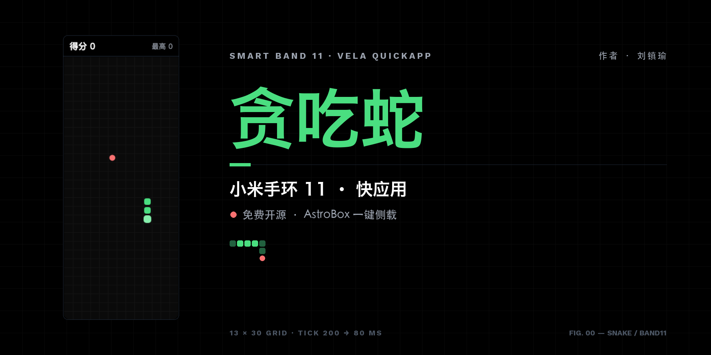
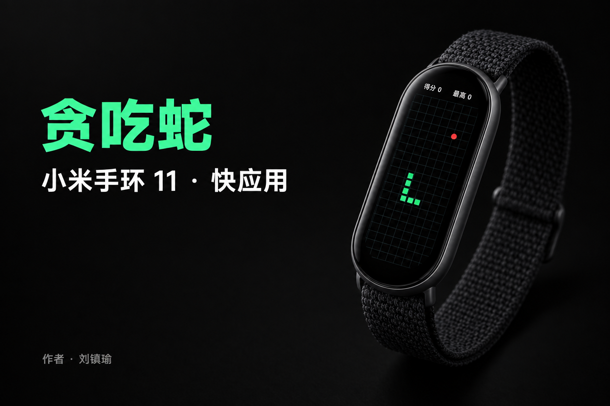
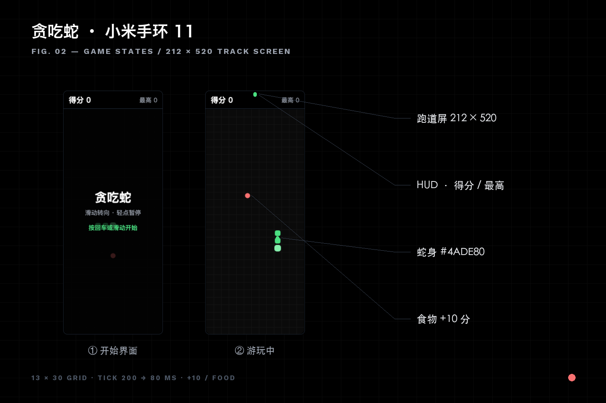
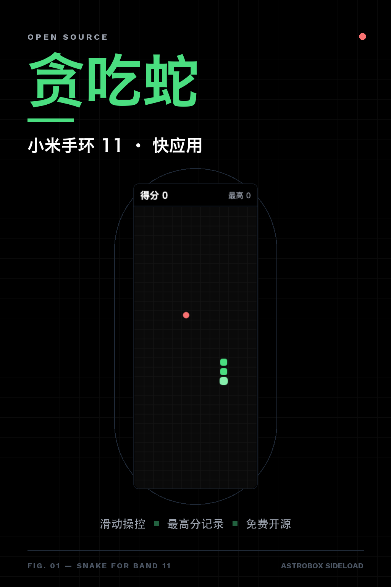

<p align="center">
  
</p>

<h1 align="center">贪吃蛇 · 小米手环 11</h1>

<p align="center">
  跑在小米手环 11 上的经典贪吃蛇 —— Vela 快应用 · 免费开源 · AstroBox 一键侧载
</p>

<p align="center">
  
  
  
  
</p>

---

## 关于

这是一条能戴在手腕上的贪吃蛇。项目包含两个可以跑的形态：**浏览器里的可玩原型**，以及可直接侧载进小米手环 11 的 **Vela 快应用（.rpk）**——不需要刷机、不需要官方商店，Mac/Windows 上用 AstroBox 三步就能装进手环。

<p align="center">
  
</p>

## 特性

- **为 212×520 跑道屏而生** —— HUD 40px + 13×30 网格，AMOLED 纯黑底，霓虹绿蛇身，零烧屏风险配色
- **滑动操控** —— 上下左右滑动转向，轻点暂停/继续，游戏结束再滑一次重开
- **渐进加速** —— 200ms 起步节拍，每吃一个食物提速 4ms，下限 80ms
- **最高分本地保存** —— `@system.storage` 持久化，回调只允许抬高，竞态也不会丢分
- **结构级防掉头** —— 反向输入只对照当前方向，同一 tick 连按两次也无法 180° 撞颈
- **生命周期干净** —— 切后台自动暂停并清定时器，页面销毁不留悬挂回调

<p align="center">
  
</p>

## 快速开始：装进你的手环 11

1. **安装 AstroBox**（第三方穿戴工具箱，macOS / Windows / Linux / Android / iOS 均有）

   ```bash
   curl -fsSL https://abox.run/install.sh | bash    # macOS / Linux
   ```

   也可从 [官网下载页](https://abox.run/docs/usage/install) 获取 dmg。若被 Gatekeeper 拦截：

   ```bash
   sudo xattr -r -d com.apple.quarantine /Applications/AstroBox.app
   ```

2. **连接手环** —— 打开 AstroBox，登录小米账号同步出小米手环 11，蓝牙配对。

3. **推送安装** —— 把下面的包直接拖进 AstroBox 窗口（或设备页 → 加号选文件），点队列「开始」：

   - 推荐：[`quickapp/dist/com.example.snake.band11.release.1.0.0.rpk`](quickapp/dist/com.example.snake.band11.release.1.0.0.rpk)（自签 release 包）
   - 装不上时改试：[`quickapp/dist/com.example.snake.band11.debug.1.0.0.rpk`](quickapp/dist/com.example.snake.band11.debug.1.0.0.rpk)（debug 包）

装好后在手环应用列表里找「贪吃蛇」。

> **说明**：本项目为非官方第三方作品，与小米公司无关联；侧载仅安装应用包、不修改系统固件，但请自行评估第三方资源风险。

## 玩法

| 操作 | 手势 |
| --- | --- |
| 转向 | 上 / 下 / 左 / 右滑动 |
| 暂停 / 继续 | 轻点屏幕 |
| 开始 / 重开 | 开始页或结束后轻点、滑动 |

撞墙或咬到自己即结束，每个食物 +10 分。

## 在浏览器里先玩一把

不想装环境？直接用浏览器打开单文件原型（无需构建、无外部依赖）：

```bash
open prototype/index.html
```

桌面调试支持方向键 / WASD 转向、空格暂停、回车重开。自动化验证：

```bash
python3 scripts/verify_prototype.py   # headless 9 项断言
```

## 从源码打出 rpk

需要 Node.js 环境：

```bash
npm i -g aiot-toolkit                 # 官方命令行工具（无需 IDE）
cd quickapp && npm i

# 自签证书（release 必需；sign/ 不入库，每个开发者自生成）
mkdir -p sign
openssl req -newkey rsa:2048 -nodes -keyout sign/private.pem \
  -x509 -days 3650 -out sign/certificate.pem

aiot build     # → dist/*.debug.rpk
aiot release   # → dist/*.release.rpk（签名包）
```

> ⚠️ aiot-toolkit 会在失败时仍返回退出码 0，请以 `dist/` 下产物与 zip 结构为准判断构建是否成功。

## 项目结构

```
├── prototype/            # 浏览器可玩原型（单文件 index.html）
├── quickapp/             # Vela 快应用工程
│   ├── src/
│   │   ├── manifest.json # designWidth: 212 · system.storage
│   │   └── pages/index/index.ux
│   └── dist/             # debug + release 双 rpk
├── promo/                # 宣传图 + 可复现的生成脚本
├── scripts/              # headless 验证脚本
└── docs/compose/spec/    # 特性规格与完整设计文档
```

## 技术花絮

- **Vela 快应用没有 canvas** —— 渲染改用 `div` 绝对定位 + 下标对齐重建视图数组；`div` 的 `for` 不接受动态 `tid`
- **跑道屏适配** —— `manifest.json` 中 `designWidth: 212` 实现 1:1 像素映射；两端圆弧区域留安全边距
- **掉头保护的不变式** —— 目录只在 `step()` 中被覆盖，因此「反向输入只对照当前方向」在任意连按序列下都不可能产生单步 180°
- **完整调研与验证记录** —— 见 [`docs/compose/spec/snake-game.md`](docs/compose/spec/snake-game.md)，含打包链路 16 条来源与两轮独立评审记录

## 相关链接

- [AstroBox 工具箱文档](https://abox.run/docs/usage)
- [Xiaomi Vela 快应用官方文档](https://iot.mi.com/vela/quickapp/zh/guide/start/project-overview.html)
- [米坛社区 · 手环 DIY](https://wiki.bandbbs.cn/)

## 作者

**刘镇瑜**

<p align="center">
  
</p>
